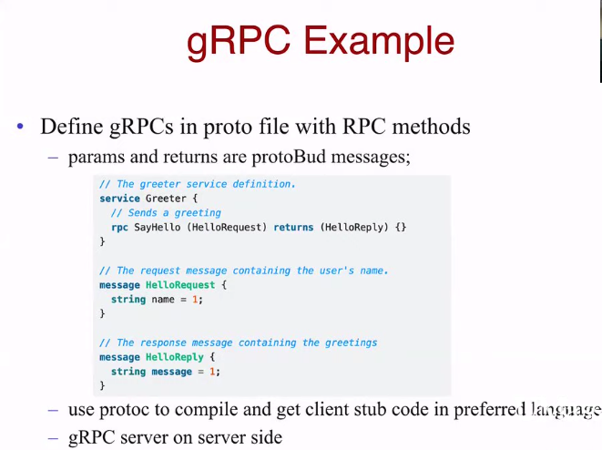
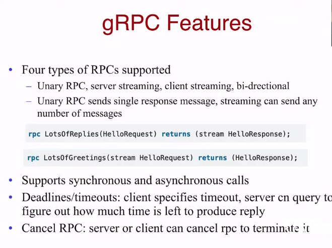

## gPRC -A high performance, open source universal RPC framework

## Why gRPC?

gRPC is a modern open source high performance Remote Procedure Call (RPC) framework that can run in any environment. It can efficiently connect services in and across data centers with pluggable support for load balancing, tracing, health checking and authentication. It is also applicable in last mile of distributed computing to connect devices, mobile applications and browsers to backend services.

**Google Remote Procedure Call** is an open source remote procedure call Google  in 2015 as the next generation of the RPC infrastructure Stubby. It uses HTTP/2 for transport, [Protocol Buffers](https://en.wikipedia.org/wiki/Protocol_Buffers) as the [interface description language](https://en.wikipedia.org/wiki/Interface_description_language), and provides features such as authentication, bidirectional streaming and [flow control](https://en.wikipedia.org/wiki/Flow_control_(data)), blocking or nonblocking bindings, and cancellation and timeouts. It generates cross-platform client and server bindings for many languages. Most common usage scenarios include connecting services in a [microservices](https://en.wikipedia.org/wiki/Microservices) style architecture, or connecting mobile device clients to backend services.

### Simple service definition

Define your service using Protocol Buffers, a powerful binary serialization toolset and language

### Start quickly and scale

Install runtime and dev environments with a single line and also scale to millions of RPCs per second with the framework

### Works across languages and platforms

Automatically generate idiomatic client and server stubs for your service in a variety of languages and platforms

### Bi-directional streaming and integrated auth

Bi-directional streaming and fully integrated pluggable authentication with HTTP/2-based transport

##### gRPC's complex use of HTTP/2 makes it impossible to implement a gRPC client in the browser, instead requiring a proxy

#### gRPC is a [CNCF](https://cncf.io/) incubation project now.

#### gRPC Example：

#### gRPC Features:

